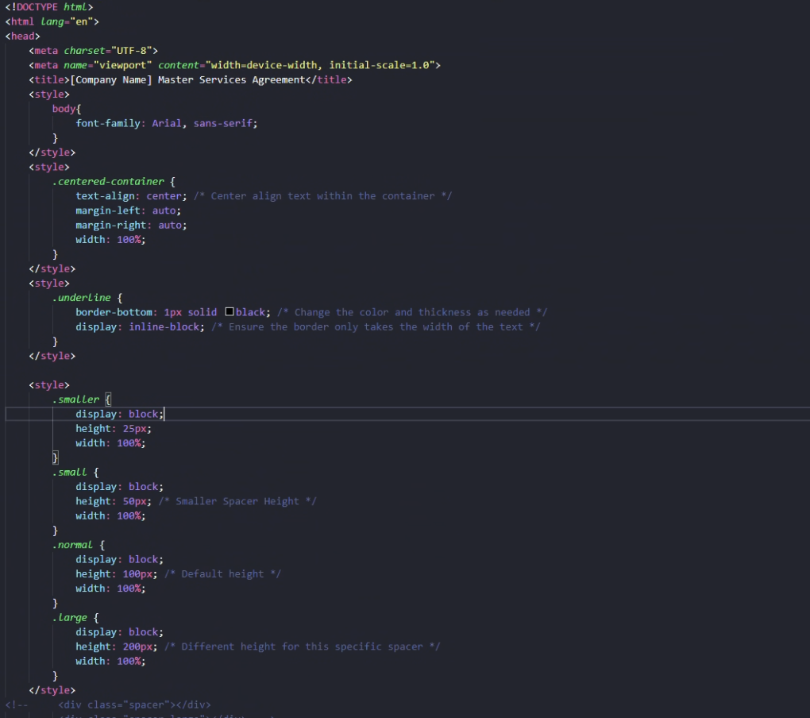

# *HTML/CSS*

## Objective
Update website pages using HTML from Text Editors with Wordpress.

## Implementation Details
**Tools Used:** 
- HTML, CSS, Wordpress

**Scope:** 
- Convert Website pages to use HTML and CSS to have consistent formatting and easy future changes.

## Challenges and Solutions
**Challenge:** 
- Remove old verbage and convert new verbage into HTML using CSS for styling to meet Organizational standard.

**Solution:** 
- Converted content into HTML.
- Created styles using CSS to present readable content on the company website.

## Screenshots

- Sample Image of some of the CSS styles used to make the update.

- Sample Image of the HTML content used.

## Outcomes
- Created a coded format of the company website page for easy future editing.
- Consistent formatting of term web pages
- Performance of website pages loading that is using HTML
- Portability: HTML files can be moved more easily than the wordpress page. 