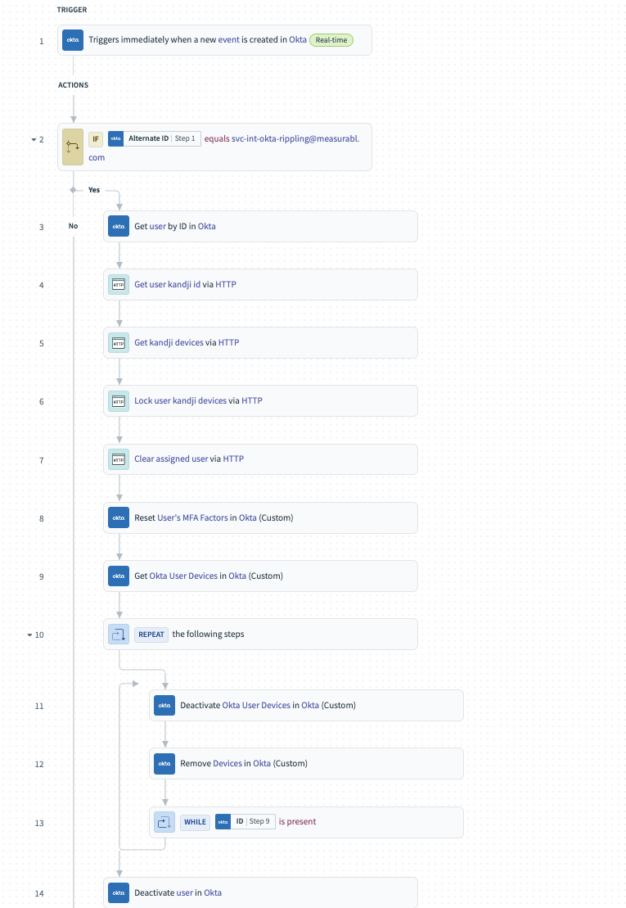
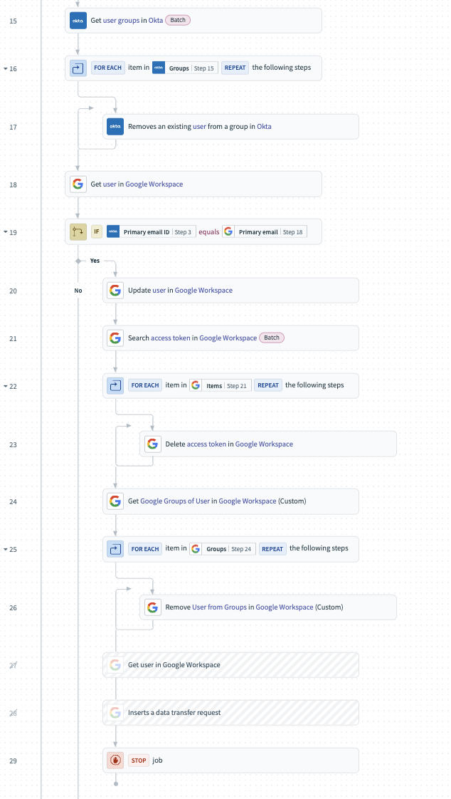
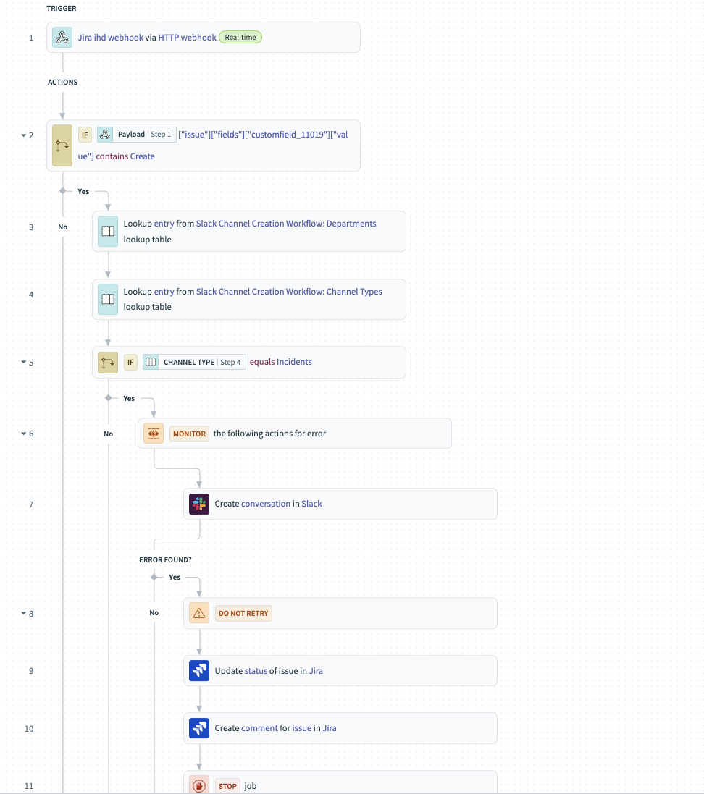
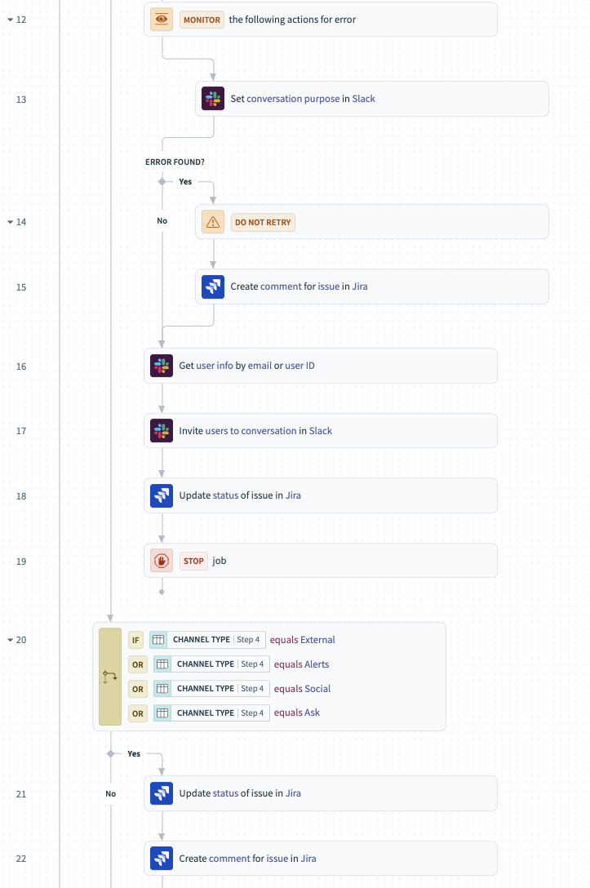
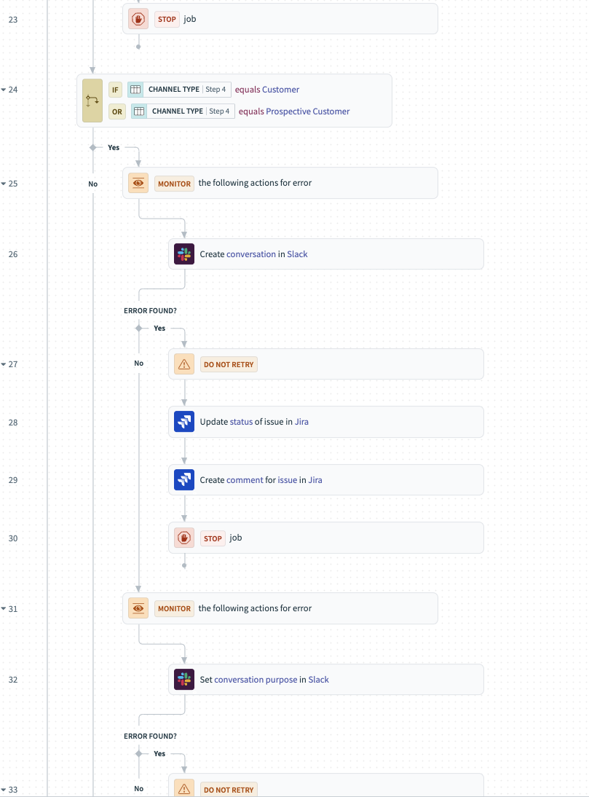
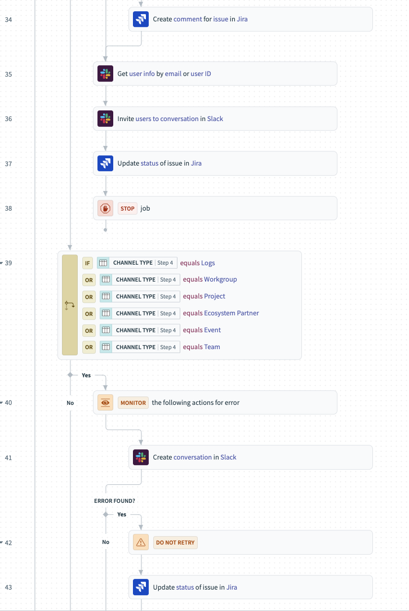
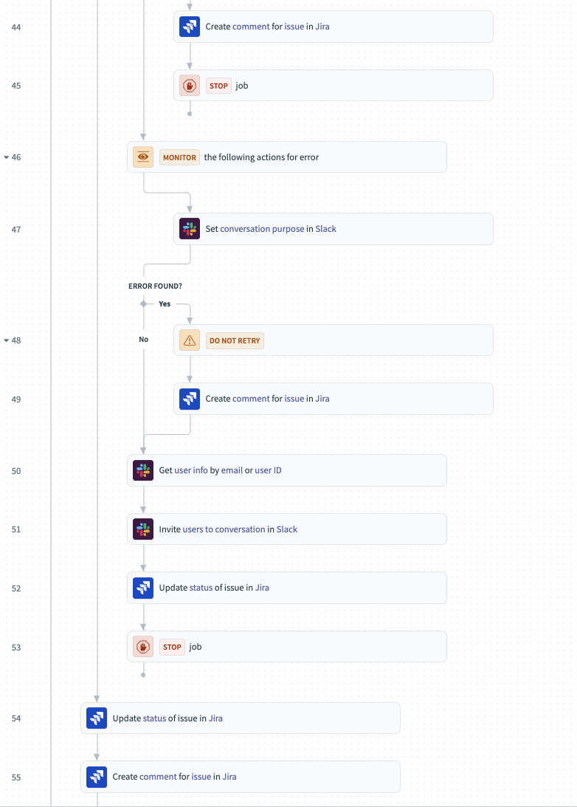
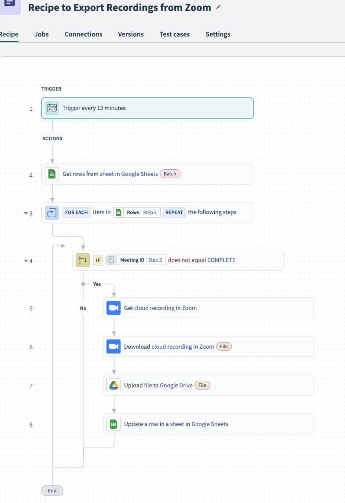

# *Automation workflows with Workato*

## Overview
Created Workato workflows to automate manual tasks.

## Implementation Details
**Tools Used:** 
- Okta, Workato, Google Workspace

**Scope:** 
- Automate manual tasks using a low-code IPaaS solution such as Workato

## Challenges and Solutions
**Challenge:** 
- Automate manual tasks as much as possible when dealing with data, requests, and employees.

**Solution:** 
- Automated parts of the employee offboarding.
- Automated data transformation and storage.

**Conclusion**
- Implementing a low-code solution tool or IPaaS such as Workato allowed for automating tasks that would otherwise be complex or time consuming. The tool was multipurpose allowing for automating onboarding and offboarding tasks that were not already natively integrated interactions (i.e Okta deactivation triggers removal of users in integrated apps in Okta that supported provisioning). Other use cases have been to automate data transformation such as downloading hundreds of Gong calls via their URLs and importing them into Google Drive. This allowed us to archive old calls to free up space and have historical data if need be for the team that needed it. Automation was key in completing tasks quickly and efficiently minimizing the time spent doing them manually, allowing the IT team to be lean.

## Screenshots

### Employee Offboarding
- This addresses different triggers and if statements in order to catch different scenarios in this specific environment. Removes access tokens and moves user to _ARCHIVE OU in Google to ensure oauth apps are removed.

### Create Slack Channels from Jira Service Desk Request
- This workflow uses workato to take in the reqeust ID from Jira ticket request and uses that information to create a slack channel and resolve ticket on completion. Error handling included if error occurs.

### Archive Zoom Calls from a CSV imported into Google Sheets
- This workflow reads a google sheet that has an imported CSV that was obtained. Reads the CSV for the meeting ID and attributes such as name. Downloads and transforms the output information (title, name, user) for better searchability when downloaded then uploaded to Google drive

### Archive Gong calls from CSV imported into Google Sheets
- This workflow reads a google sheet that has an imported CSV that was obtained. Reads the CSV for necessary unique identifires. Modifies the output (title, user, time) for better searchability when downloaded then uploaded into Google drive.

## Outcomes
- Reduced manual actions by 50%.
- Transformed Data to be archived in Google Drive.
- Created scalable solutions to be used again for future projects.
- Automated level 1 Help Desk taks.