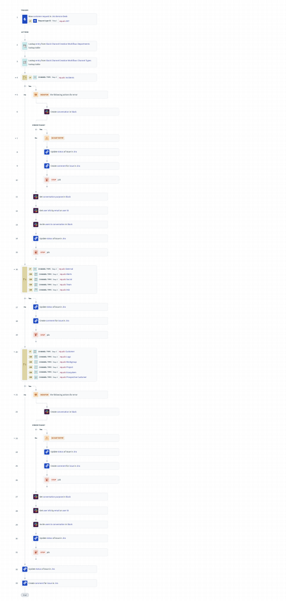

# Automation workflows with Workato

## Objective
Created Workato workflows to automate manual tasks.

## Implementation Details
**Tools Used:** 
- Okta, Workato, Google Workspace  
**Scope:** 
- Automate manual tasks using a low-code IPaaS solution such as Workato

## Challenges and Solutions
**Challenge:** 
- Automate manual tasks as much as possible when dealing with data, requests, and employees.
**Solution:** 
- Automated parts of the employee offboarding.
- Automated data transformation and storage.

## Screenshots
**Automation Workflows using Workato**
- Employee Offboarding
    - This addresses different triggers and if statements in order to catch different scenarios in this specific environment. Removes access tokens and moves user to _ARCHIVE OU in Google to ensure oauth apps are removed.

- Create Slack Channels from Jira Service Desk Request
    - This workflow uses workato to take in the reqeust ID from Jira ticket request and uses that information to create a slack channel and resolve ticket on completion. Error handling included if error occurs.

- Archive Zoom Calls from a CSV imported into Google Sheets
    - This workflow reads a google sheet that has an imported CSV that was obtained. Reads the CSV for the meeting ID and attributes such as name. Downloads and transforms the output information (title, name, user) for better searchability when downloaded then uploaded to Google drive

- Archive Gong calls from CSV imported into Google Sheets
    - This workflow reads a google sheet that has an imported CSV that was obtained. Reads the CSV for necessary unique identifires. Modifies the output (title, user, time) for better searchability when downloaded then uploaded into Google drive.

- [Archive Gong Call recordings](Images_Automation/automation-archive-gong-calls.png)

## Outcomes
- Reduced manual actions by 50%.
- Transformed Data to be archived in Google Drive.
- Created scalable solutions to be used again for future projects.
- Automated level 1 Help Desk taks.