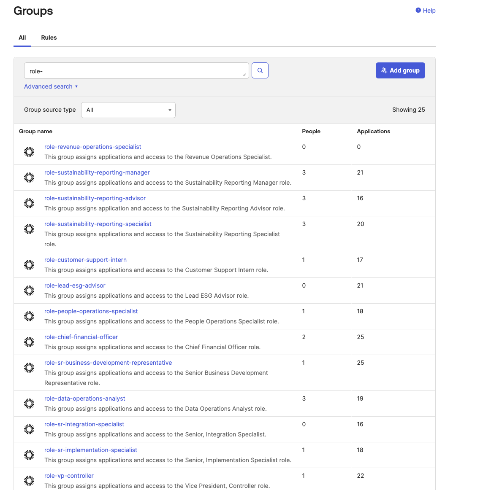
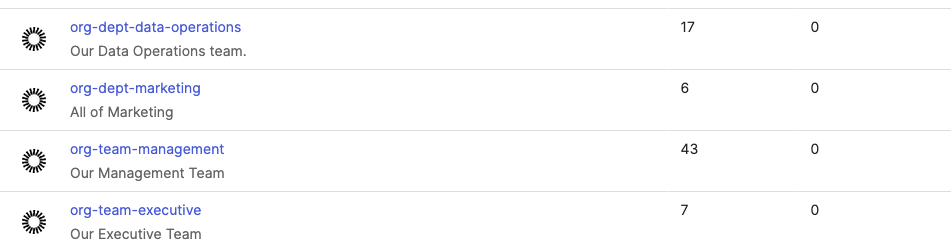
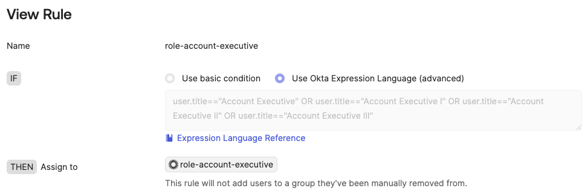

# RBAC Implementation with Okta

## Objective
Implemented role-based access control (RBAC) using Okta to reduce provisioning time by 50% and enforce least-privilege access.

## Implementation Details
- **Tools Used:** Okta, Google Workspace, M365, Salesforce, Etc. Apps tied to Okta via API for SCIM and SAML. 
- **Scope:** Created roles for every role in the business as well as Org/Dept groups.

## Challenges and Solutions
- **Challenge:** Inconsistent role definitions across departments.
- **Solution:** Worked with stakeholders to align roles with Okta groups and implemented automation.

## Screenshots
Okta RBAC Configurations
- Okta RBAC Groups
    - Roles and Departments Sample

- Okta Group Rules
    - Sample list of groups made with the role in mind.

- Okta Group Rule Sample Details
 - This image shows the rule using the user attribute of their title to add to this group.

## Outcomes
- Reduced provisioning time by 50%.
- Simplified access reviews for SOC2 compliance.
- Created roles that followed least privleged access.

